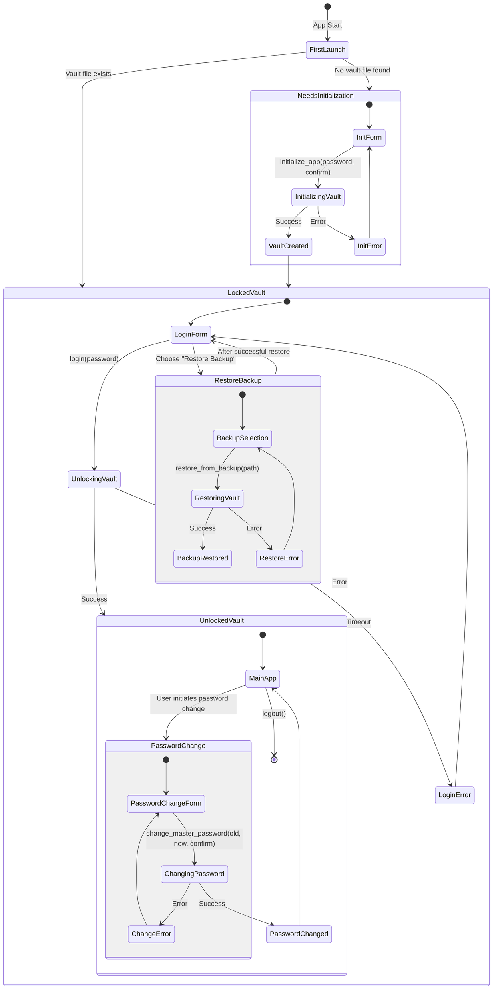

# Initialization and Authentication Flow

```mermaid
stateDiagram-v2
    [*] --> FirstLaunch: App Start
    FirstLaunch --> NeedsInitialization: No vault file found
    FirstLaunch --> LockedVault: Vault file exists
    
    state NeedsInitialization {
        [*] --> InitForm
        InitForm --> InitializingVault: initialize_app(password, confirm)
        InitializingVault --> VaultCreated: Success
        InitializingVault --> InitError: Error
        InitError --> InitForm
    }
    
    state LockedVault {
        [*] --> LoginForm
        LoginForm --> UnlockingVault: login(password)
        UnlockingVault --> UnlockedVault: Success
        UnlockingVault --> LoginError: Error
        LoginError --> LoginForm
        
        state RestoreBackup {
            [*] --> BackupSelection
            BackupSelection --> RestoringVault: restore_from_backup(path)
            RestoringVault --> BackupRestored: Success
            RestoringVault --> RestoreError: Error
            RestoreError --> BackupSelection
        }
        
        LoginForm --> RestoreBackup: Choose "Restore Backup"
        RestoreBackup --> LoginForm: After successful restore
    }
    
    state UnlockedVault {
        [*] --> MainApp
        MainApp --> PasswordChange: User initiates password change
        
        state PasswordChange {
            [*] --> PasswordChangeForm
            PasswordChangeForm --> ChangingPassword: change_master_password(old, new, confirm)
            ChangingPassword --> PasswordChanged: Success
            ChangingPassword --> ChangeError: Error
            ChangeError --> PasswordChangeForm
        }
        
        PasswordChanged --> MainApp
        MainApp --> [*]: logout()
    }
    
    VaultCreated --> LockedVault
    UnlockedVault --> LockedVault: Logout/Timeout
```
